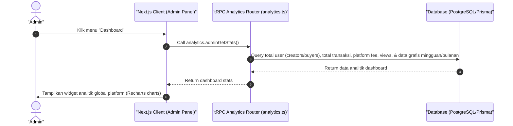

# Sequence Diagram - Lihat Dashboard (Admin)

Diagram ini menjelaskan alur kasus penggunaan (use case) ke-1: **Lihat Dashboard (Admin)** pada platform CuanIN.

### Detail Langkah / Deskripsi Alur:

Admin meminta data ringkasan analitik statistik global platform (total user, transaksi sukses, platform fee masuk, traffic views, kategori produk) menggunakan analytics.adminGetStats.
