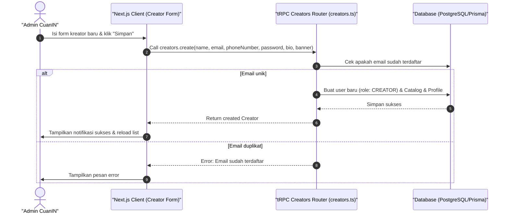

# Sequence Diagram - Tambah Kreator (Admin)

Diagram ini menjelaskan alur kasus penggunaan (use case) ke-3: **Tambah Kreator (Admin)** pada platform CuanIN.

### Detail Langkah / Deskripsi Alur:
Admin mendaftarkan akun kreator baru secara langsung ke database CuanIN menggunakan creators.create.
