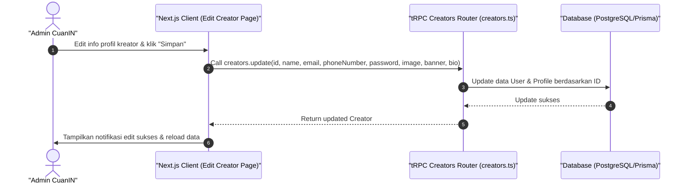

# Sequence Diagram - Edit Kreator (Admin)

Diagram ini menjelaskan alur kasus penggunaan (use case) ke-4: **Edit Kreator (Admin)** pada platform CuanIN.

### Detail Langkah / Deskripsi Alur:
Admin menyunting detail profil kreator atau menyetel parameter profil menggunakan creators.update.
