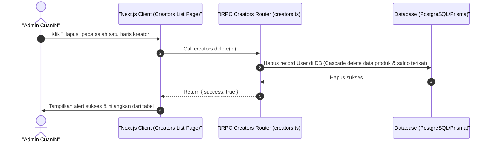

# Sequence Diagram - Hapus Kreator (Admin)

Diagram ini menjelaskan alur kasus penggunaan (use case) ke-5: **Hapus Kreator (Admin)** pada platform CuanIN.

### Detail Langkah / Deskripsi Alur:
Admin menghapus akun kreator secara permanen dari basis data CuanIN menggunakan creators.delete.
