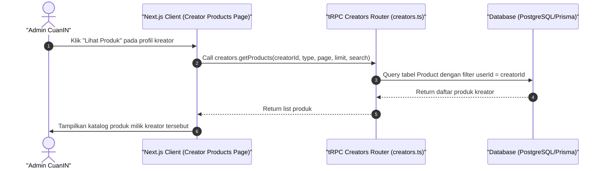

# Sequence Diagram - Lihat Daftar Produk Kreator (Admin)

Diagram ini menjelaskan alur kasus penggunaan (use case) ke-6: **Lihat Daftar Produk Kreator (Admin)** pada platform CuanIN.

### Detail Langkah / Deskripsi Alur:
Admin memeriksa produk-produk apa saja yang dimiliki atau diterbitkan oleh salah satu kreator tertentu menggunakan creators.getProducts.
