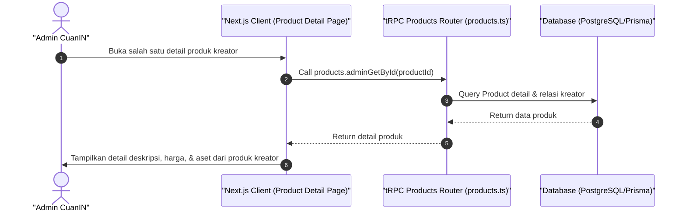

# Sequence Diagram - Lihat Detail Produk Kreator (Admin)

Diagram ini menjelaskan alur kasus penggunaan (use case) ke-7: **Lihat Detail Produk Kreator (Admin)** pada platform CuanIN.

### Detail Langkah / Deskripsi Alur:
Admin melihat spesifikasi detail dari sebuah produk digital/kelas/webinar milik kreator.
