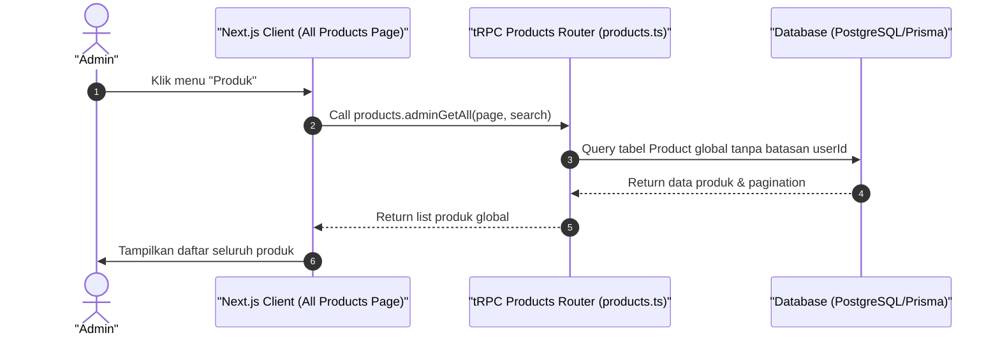

# Sequence Diagram - Lihat Daftar Semua Produk (Admin)

Diagram ini menjelaskan alur kasus penggunaan (use case) ke-8: **Lihat Daftar Semua Produk (Admin)** pada platform CuanIN.

### Detail Langkah / Deskripsi Alur:
Admin memantau seluruh katalog produk digital, kelas, dan webinar di platform CuanIN secara global.
