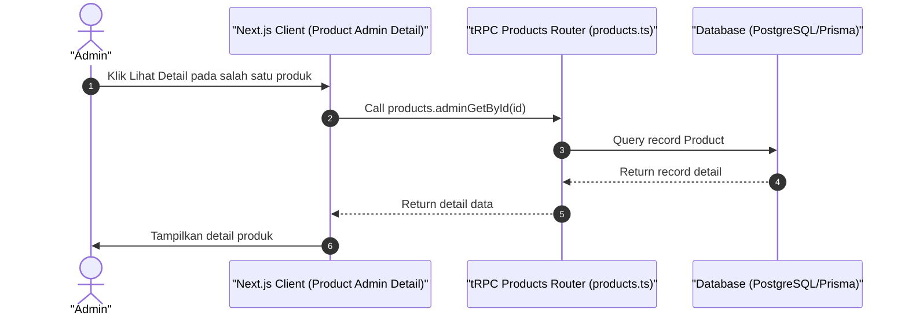

# Sequence Diagram - Lihat Detail Produk (Admin)

Diagram ini menjelaskan alur kasus penggunaan (use case) ke-9: **Lihat Detail Produk (Admin)** pada platform CuanIN.

### Detail Langkah / Deskripsi Alur:
Admin membuka detail produk secara terpusat dari daftar produk global.
