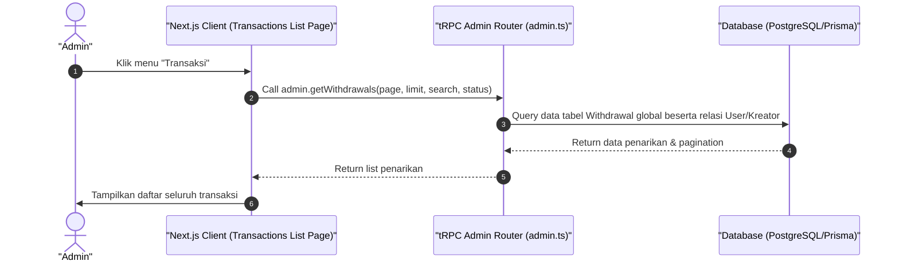

# Sequence Diagram - Lihat Daftar Transaksi (Admin)

Diagram ini menjelaskan alur kasus penggunaan (use case) ke-10: **Lihat Daftar Transaksi (Admin)** pada platform CuanIN.

### Detail Langkah / Deskripsi Alur:
Admin memantau riwayat pengajuan penarikan dana kreator secara global menggunakan admin.getWithdrawals.
