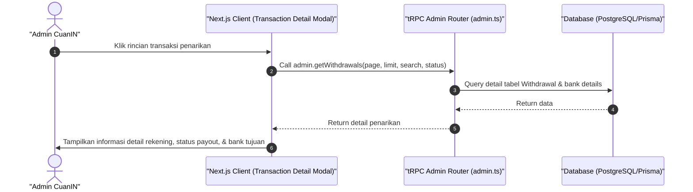

# Sequence Diagram - Lihat Detail Transaksi (Admin)

Diagram ini menjelaskan alur kasus penggunaan (use case) ke-11: **Lihat Detail Transaksi (Admin)** pada platform CuanIN.

### Detail Langkah / Deskripsi Alur:
Admin melihat bukti detail transfer, jumlah platform fee, & status transfer ke kreator.
