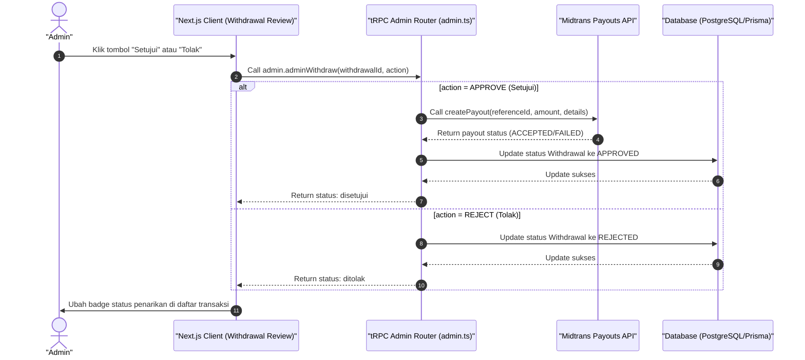

# Sequence Diagram - Konfirmasi Tarik Saldo (Admin)

Diagram ini menjelaskan alur kasus penggunaan (use case) ke-12: **Konfirmasi Tarik Saldo (Admin)** pada platform CuanIN.

### Detail Langkah / Deskripsi Alur:
Admin meninjau pengajuan penarikan dana kreator dan memilih untuk menyetujui atau menolak. Jika disetujui, server memanggil Xendit Payouts API untuk mengeksekusi transfer dana. Jika ditolak, server langsung memperbarui status di database tanpa memanggil Xendit.
