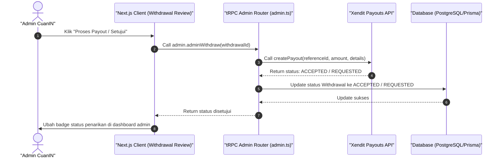

# Sequence Diagram - Konfirmasi Tarik Saldo (Admin)

Diagram ini menjelaskan alur kasus penggunaan (use case) ke-12: **Konfirmasi Tarik Saldo (Admin)** pada platform CuanIN.

### Detail Langkah / Deskripsi Alur:
Admin mengonfirmasi pengajuan penarikan dana kreator dan mengeksekusinya via payout gateway Xendit.
