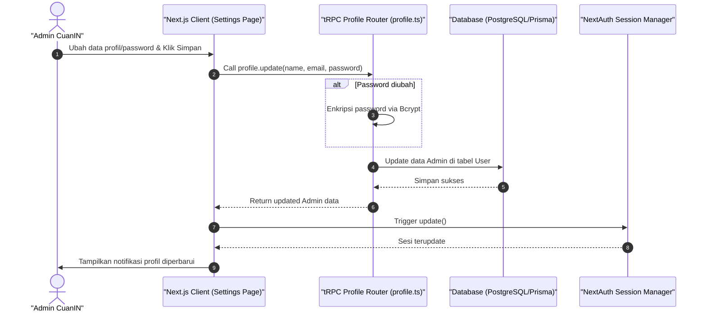

# Sequence Diagram - Edit Profil (Admin)

Diagram ini menjelaskan alur kasus penggunaan (use case) ke-13: **Edit Profil (Admin)** pada platform CuanIN.

### Detail Langkah / Deskripsi Alur:
Admin mengupdate kredensial profil login dan password administratifnya.
