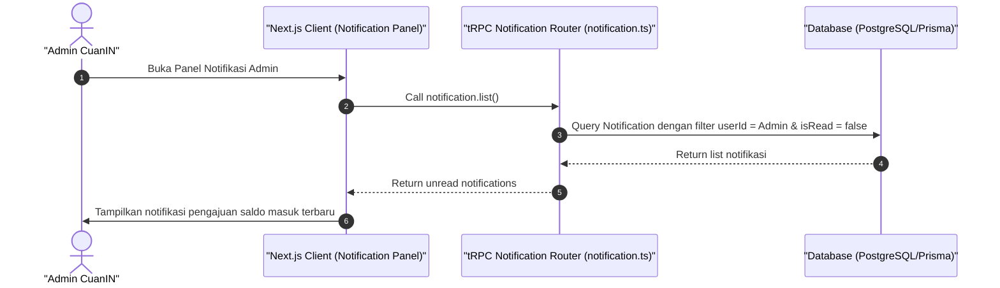

# Sequence Diagram - Lihat Notifikasi (Admin)

Diagram ini menjelaskan alur kasus penggunaan (use case) ke-14: **Lihat Notifikasi (Admin)** pada platform CuanIN.

### Detail Langkah / Deskripsi Alur:
Admin memantau pemberitahuan sistem terkait pengajuan penarikan dana baru yang diajukan oleh kreator.
