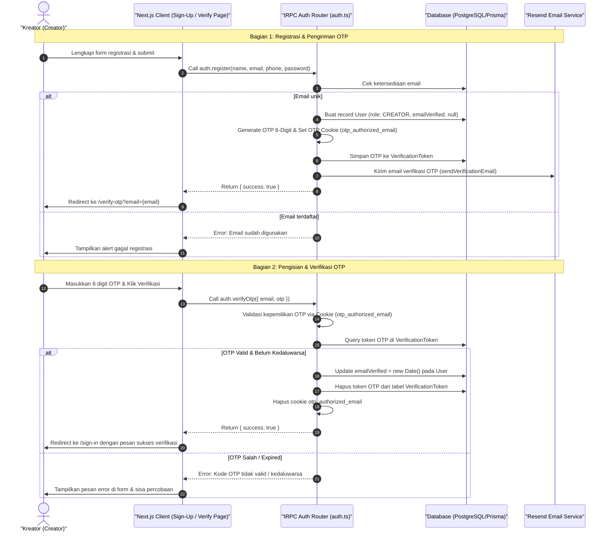

# Sequence Diagram - Registrasi Akun & Verifikasi OTP (Kreator)

Diagram ini menjelaskan alur kasus penggunaan (use case) ke-15: **Registrasi Akun & Verifikasi OTP (Kreator)** pada platform CuanIN.

### Detail Langkah / Deskripsi Alur:

Kreator baru mendaftarkan akun di platform CuanIN, memverifikasi alamat email menggunakan kode OTP 6-digit, dan diarahkan ke halaman login setelah akun berhasil diaktifkan.
