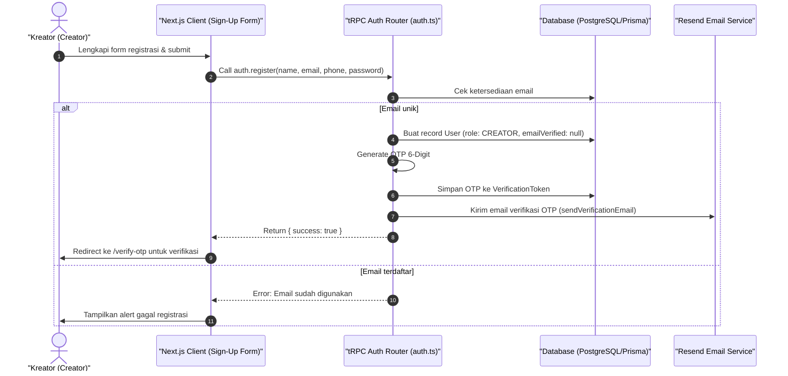

# Sequence Diagram - Registrasi Akun (Kreator)

Diagram ini menjelaskan alur kasus penggunaan (use case) ke-15: **Registrasi Akun (Kreator)** pada platform CuanIN.

### Detail Langkah / Deskripsi Alur:
Kreator baru mendaftarkan akun di platform CuanIN dan memicu proses verifikasi alamat email via OTP.
