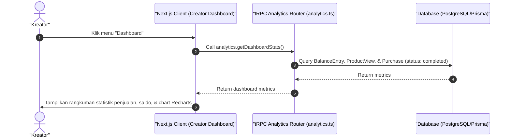

# Sequence Diagram - Lihat Dashboard (Kreator)

Diagram ini menjelaskan alur kasus penggunaan (use case) ke-16: **Lihat Dashboard (Kreator)** pada platform CuanIN.

### Detail Langkah / Deskripsi Alur:
Kreator membuka dasbor analitik penjualan untuk melihat grafik keuntungan dan jumlah pembeli.
