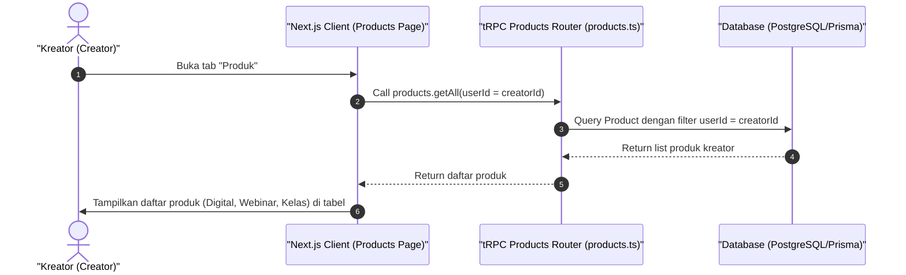

# Sequence Diagram - Lihat Daftar Produk (Kreator)

Diagram ini menjelaskan alur kasus penggunaan (use case) ke-17: **Lihat Daftar Produk (Kreator)** pada platform CuanIN.

### Detail Langkah / Deskripsi Alur:
Kreator mengakses daftar seluruh produk yang diterbitkan beserta statusnya.
