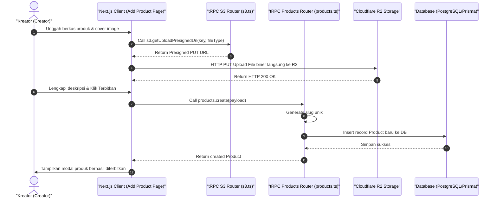

# Sequence Diagram - Tambah Produk (Kreator)

Diagram ini menjelaskan alur kasus penggunaan (use case) ke-18: **Tambah Produk (Kreator)** pada platform CuanIN.

### Detail Langkah / Deskripsi Alur:
Kreator menerbitkan produk baru dan mengunggah aset media langsung ke Cloudflare R2.
