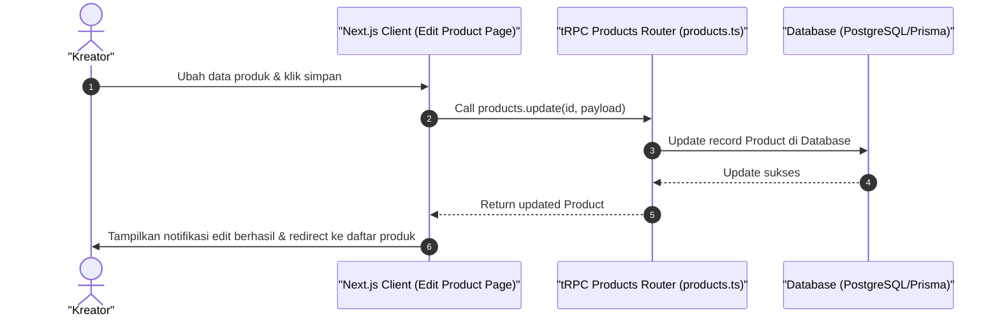

# Sequence Diagram - Edit Produk (Kreator)

Diagram ini menjelaskan alur kasus penggunaan (use case) ke-19: **Edit Produk (Kreator)** pada platform CuanIN.

### Detail Langkah / Deskripsi Alur:
Kreator menyunting informasi deskripsi, tautan materi, atau harga dari produk yang telah terbit.
