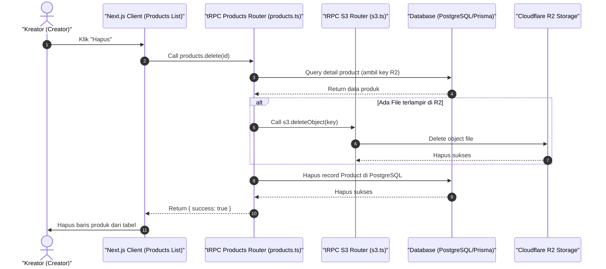

# Sequence Diagram - Hapus Produk (Kreator)

Diagram ini menjelaskan alur kasus penggunaan (use case) ke-20: **Hapus Produk (Kreator)** pada platform CuanIN.

### Detail Langkah / Deskripsi Alur:
Kreator menghapus produk secara permanen beserta semua aset filenya di Cloudflare R2.
