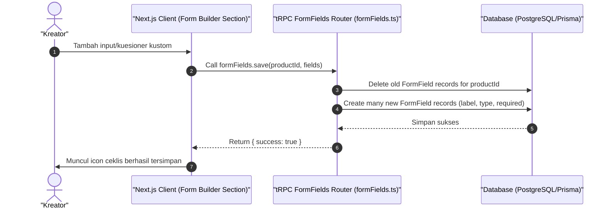

# Sequence Diagram - Kustomisasi Form (Kreator)

Diagram ini menjelaskan alur kasus penggunaan (use case) ke-21: **Kustomisasi Form (Kreator)** pada platform CuanIN.

### Detail Langkah / Deskripsi Alur:
Kreator mengatur kuesioner dinamis pada halaman checkout pembeli untuk mendapatkan informasi tambahan pembeli.
