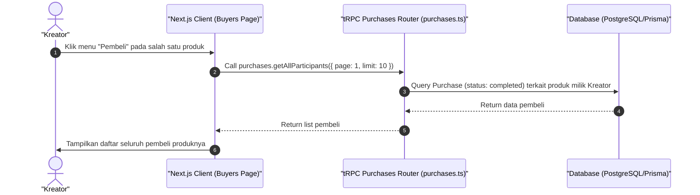

# Sequence Diagram - Lihat Daftar Pembeli (Kreator)

Diagram ini menjelaskan alur kasus penggunaan (use case) ke-22: **Lihat Daftar Pembeli (Kreator)** pada platform CuanIN.

### Detail Langkah / Deskripsi Alur:
Kreator membuka database pelanggan yang telah menyelesaikan transaksi pembelian produknya.
