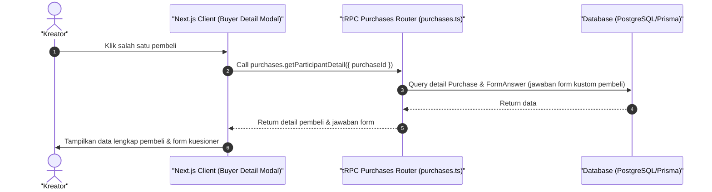

# Sequence Diagram - Lihat Detail Pembeli (Kreator)

Diagram ini menjelaskan alur kasus penggunaan (use case) ke-23: **Lihat Detail Pembeli (Kreator)** pada platform CuanIN.

### Detail Langkah / Deskripsi Alur:
Kreator memeriksa rincian jawaban form kustom & riwayat transaksi dari pembeli tertentu.
