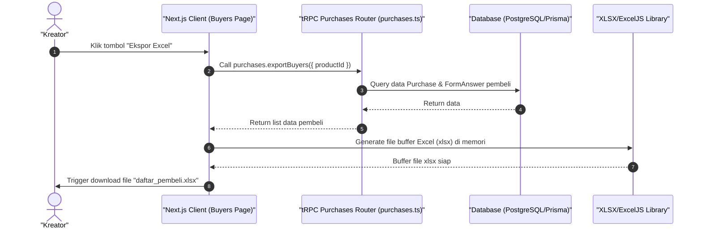

# Sequence Diagram - Export Data Pembeli ke Excel (Kreator)

Diagram ini menjelaskan alur kasus penggunaan (use case) ke-24: **Export Data Pembeli ke Excel (Kreator)** pada platform CuanIN.

### Detail Langkah / Deskripsi Alur:
Kreator mengekspor basis data pelanggan beserta jawaban kuesionernya ke spreadsheet Excel.
