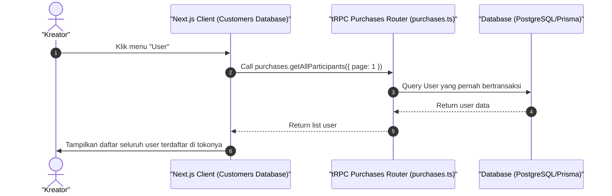

# Sequence Diagram - Lihat Daftar User (Kreator)

Diagram ini menjelaskan alur kasus penggunaan (use case) ke-25: **Lihat Daftar User (Kreator)** pada platform CuanIN.

### Detail Langkah / Deskripsi Alur:
Kreator melihat daftar seluruh identitas unik pembeli yang terdaftar di bawah catalog-nya.
