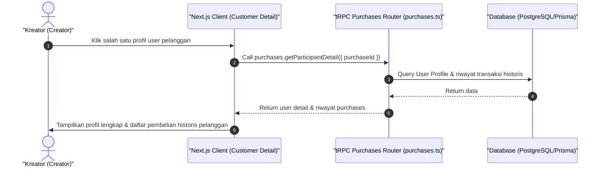

# Sequence Diagram - Lihat Detail User (Kreator)

Diagram ini menjelaskan alur kasus penggunaan (use case) ke-26: **Lihat Detail User (Kreator)** pada platform CuanIN.

### Detail Langkah / Deskripsi Alur:
Kreator melihat rincian riwayat transaksi yang pernah dilakukan oleh salah satu pembeli tertentu.
