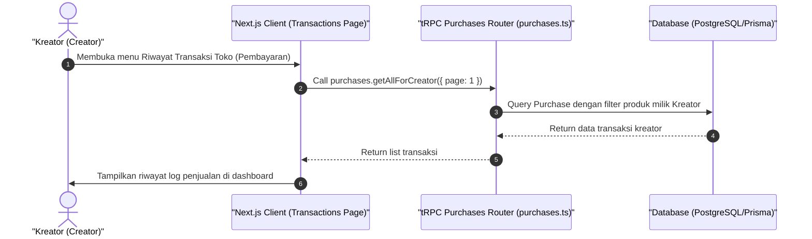

# Sequence Diagram - Lihat Daftar Transaksi (Kreator)

Diagram ini menjelaskan alur kasus penggunaan (use case) ke-27: **Lihat Daftar Transaksi (Kreator)** pada platform CuanIN.

### Detail Langkah / Deskripsi Alur:
Kreator memantau seluruh transaksi masuk atas pembelian produk-produknya.
