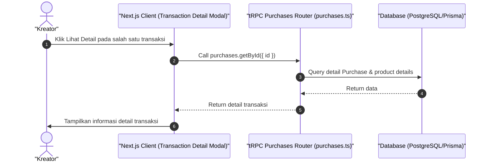

# Sequence Diagram - Lihat Detail Transaksi (Kreator)

Diagram ini menjelaskan alur kasus penggunaan (use case) ke-28: **Lihat Detail Transaksi (Kreator)** pada platform CuanIN.

### Detail Langkah / Deskripsi Alur:
Kreator memeriksa rincian potongan platform fee admin & nominal pendapatan bersih yang diterimanya.
