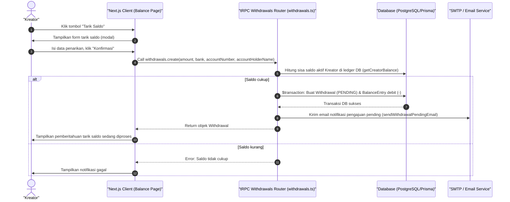

# Sequence Diagram - Tarik Saldo (Kreator)

Diagram ini menjelaskan alur kasus penggunaan (use case) ke-29: **Tarik Saldo (Kreator)** pada platform CuanIN.

### Detail Langkah / Deskripsi Alur:
Kreator mengajukan pencairan pendapatan ke rekening bank, memicu pendebitan saldo di ledger DB.
