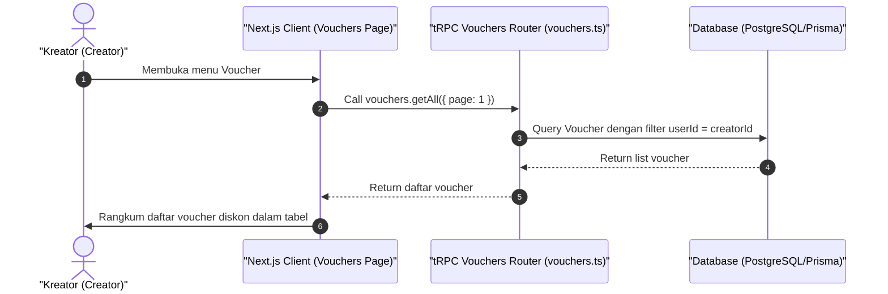

# Sequence Diagram - Lihat Daftar Voucher (Kreator)

Diagram ini menjelaskan alur kasus penggunaan (use case) ke-30: **Lihat Daftar Voucher (Kreator)** pada platform CuanIN.

### Detail Langkah / Deskripsi Alur:
Kreator melihat daftar kode promo / kupon diskon yang telah dibuat untuk tokonya.
