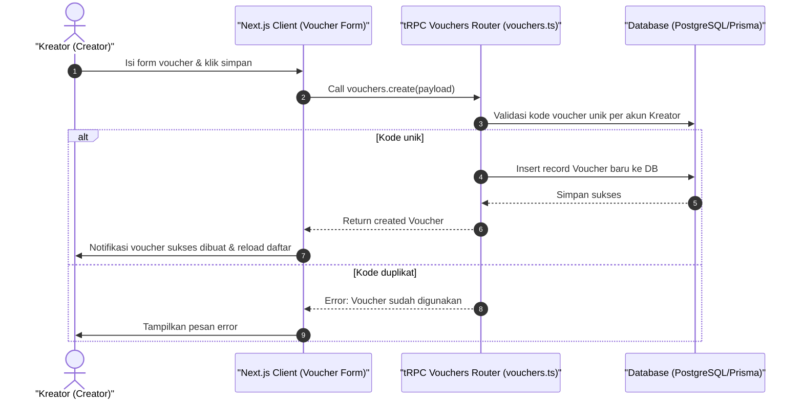

# Sequence Diagram - Tambah Voucher (Kreator)

Diagram ini menjelaskan alur kasus penggunaan (use case) ke-31: **Tambah Voucher (Kreator)** pada platform CuanIN.

### Detail Langkah / Deskripsi Alur:
Kreator menerbitkan kode voucher baru (nominal / persentase diskon) dengan batasan kuota & kedaluwarsa.
