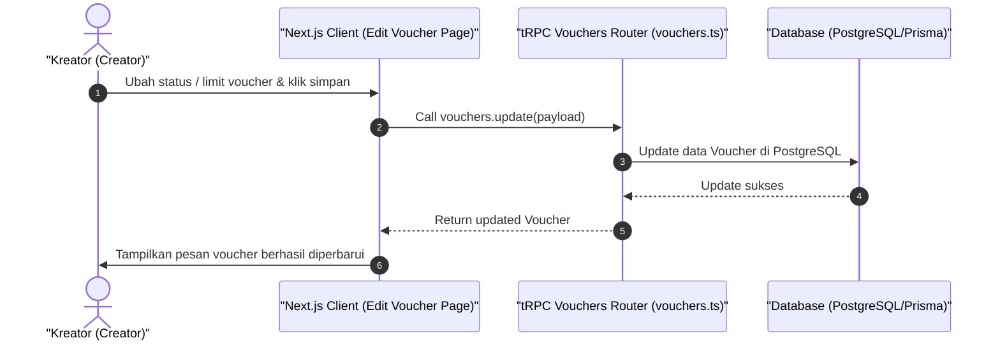

# Sequence Diagram - Edit Voucher (Kreator)

Diagram ini menjelaskan alur kasus penggunaan (use case) ke-32: **Edit Voucher (Kreator)** pada platform CuanIN.

### Detail Langkah / Deskripsi Alur:

Kreator mengubah parameter status voucher (aktif/tidak aktif) atau menambah limit kuota voucher.
