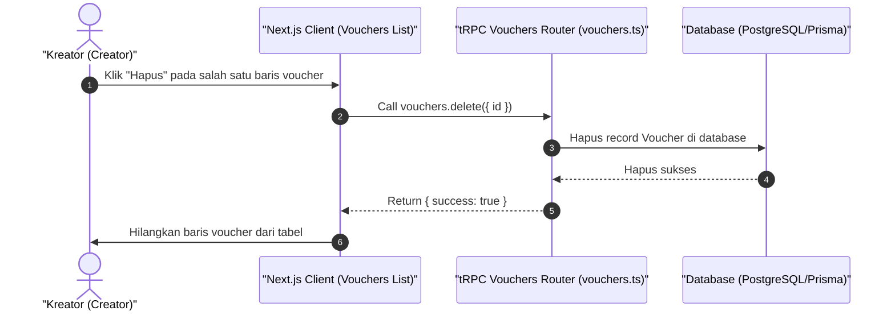

# Sequence Diagram - Hapus Voucher (Kreator)

Diagram ini menjelaskan alur kasus penggunaan (use case) ke-33: **Hapus Voucher (Kreator)** pada platform CuanIN.

### Detail Langkah / Deskripsi Alur:
Kreator membatalkan / menghapus voucher diskon dari database agar tidak bisa dipakai pembeli.
