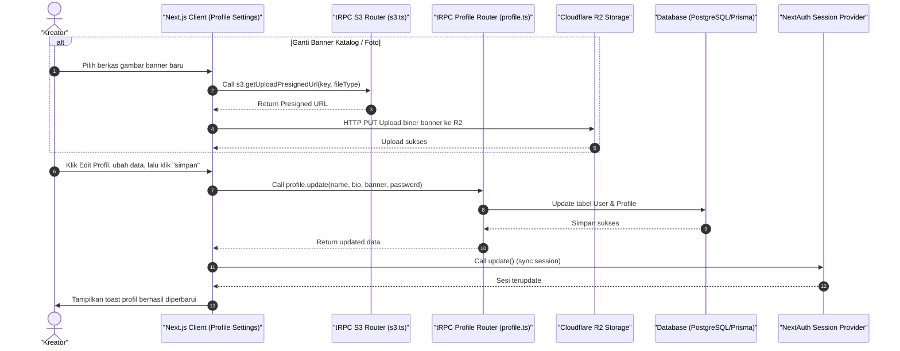

# Sequence Diagram - Edit Profil (Kreator)

Diagram ini menjelaskan alur kasus penggunaan (use case) ke-34: **Edit Profil (Kreator)** pada platform CuanIN.

### Detail Langkah / Deskripsi Alur:
Kreator mengubah deskripsi bio toko, banner toko, foto, dan informasi nama tampilan.
