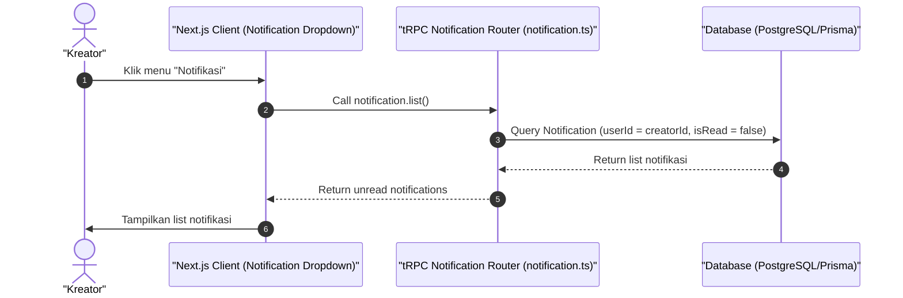

# Sequence Diagram - Lihat Notifikasi (Kreator)

Diagram ini menjelaskan alur kasus penggunaan (use case) ke-35: **Lihat Notifikasi (Kreator)** pada platform CuanIN.

### Detail Langkah / Deskripsi Alur:
Kreator memeriksa log notifikasi historis (pembayaran masuk / pencairan saldo) di dasbornya.
