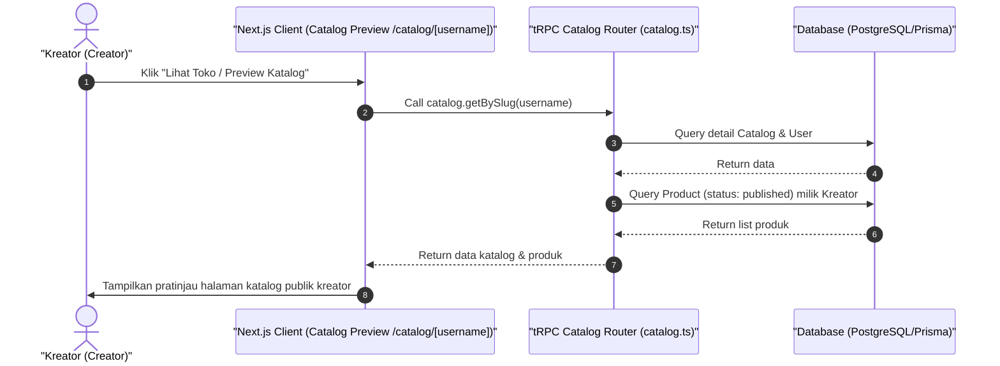

# Sequence Diagram - Lihat Katalog (Kreator)

Diagram ini menjelaskan alur kasus penggunaan (use case) ke-36: **Lihat Katalog (Kreator)** pada platform CuanIN.

### Detail Langkah / Deskripsi Alur:
Kreator melihat pratinjau (preview) halaman katalog penjualan miliknya di sisi publik.
