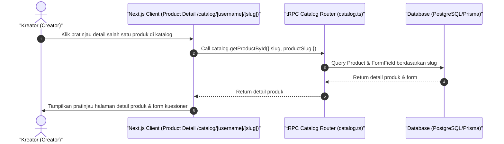

# Sequence Diagram - Lihat Detail Katalog (Kreator)

Diagram ini menjelaskan alur kasus penggunaan (use case) ke-37: **Lihat Detail Katalog (Kreator)** pada platform CuanIN.

### Detail Langkah / Deskripsi Alur:
Kreator memeriksa pratinjau visual halaman detail dari produk tertentu miliknya.
