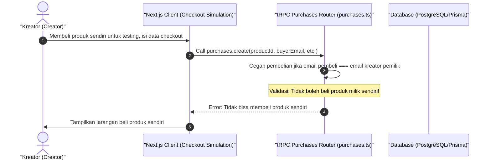

# Sequence Diagram - Daftar / Checkout (Kreator)

Diagram ini menjelaskan alur kasus penggunaan (use case) ke-38: **Daftar / Checkout (Kreator)** pada platform CuanIN.

### Detail Langkah / Deskripsi Alur:
Kreator mensimulasikan pembelian produk (sistem melarang pembelian jika email pembeli sama dengan email pemilik produk).
