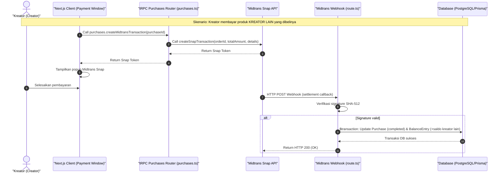

# Sequence Diagram - Bayar (Kreator)

Diagram ini menjelaskan alur kasus penggunaan (use case) ke-39: **Bayar (Kreator)** pada platform CuanIN.

### Detail Langkah / Deskripsi Alur:
Kreator membayar tagihan atas produk kreator lain via Midtrans Snap, memicu pembaruan status transaksi & saldo kreator lain via webhook.
