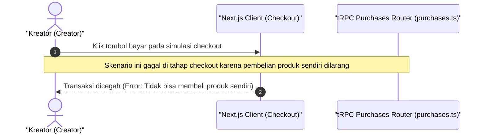

# Sequence Diagram - Bayar (Kreator)

Diagram ini menjelaskan alur kasus penggunaan (use case) ke-39: **Bayar (Kreator)** pada platform CuanIN.

### Detail Langkah / Deskripsi Alur:
Kreator dibatasi oleh sistem sehingga tidak dapat melangsungkan proses pembayaran atas produknya sendiri.
