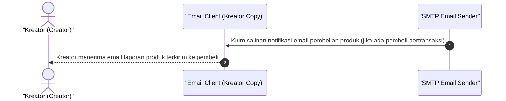

# Sequence Diagram - Akses Produk Lewat Email (Kreator)

Diagram ini menjelaskan alur kasus penggunaan (use case) ke-40: **Akses Produk Lewat Email (Kreator)** pada platform CuanIN.

### Detail Langkah / Deskripsi Alur:
Kreator menerima salinan laporan notifikasi bahwa sistem telah mengirimkan akses produk ke pelanggan.
