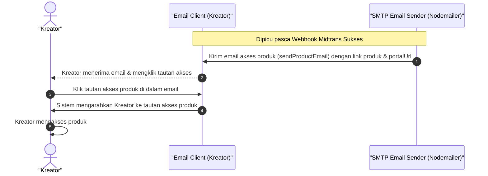

# Sequence Diagram - Akses Produk Lewat Email (Kreator)

Diagram ini menjelaskan alur kasus penggunaan (use case) ke-40: **Akses Produk Lewat Email (Kreator)** pada platform CuanIN.

### Detail Langkah / Deskripsi Alur:

**Kreator Akses Produk Lewat Email**
- **Aktor:** Kreator
- **Kondisi Awal:** Kreator sudah melakukan pembayaran dan menerima email.
- **Kondisi Akhir:** Kreator berhasil mengakses produk melalui email.

**Skenario Utama:**
1. Kreator buka email dan klik tautan akses.
2. Sistem mengarahkan Kreator ke tautan akses produk.
3. Kreator mengakses produk.
