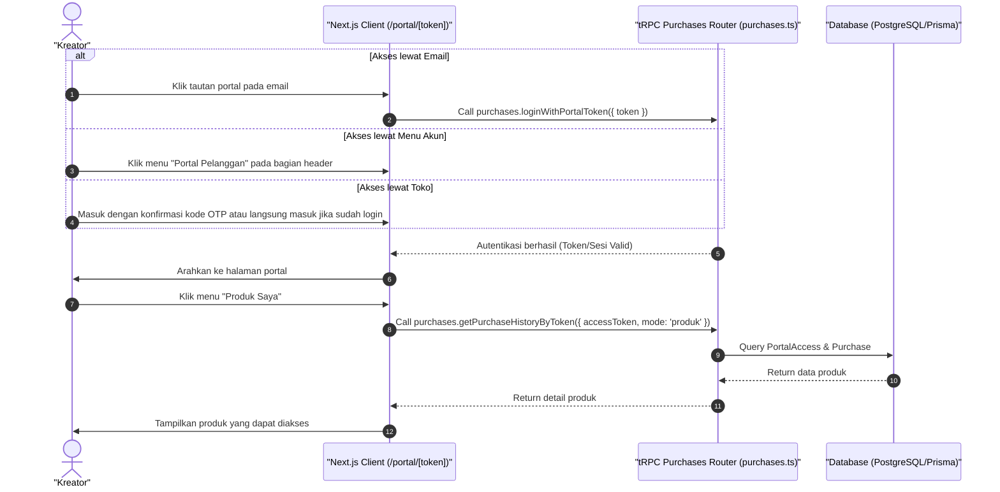

# Sequence Diagram - Akses Produk Lewat Portal (Kreator)

Diagram ini menjelaskan alur kasus penggunaan (use case) ke-41: **Akses Produk Lewat Portal (Kreator)** pada platform CuanIN.

### Detail Langkah / Deskripsi Alur:

**Kreator Akses Produk Lewat Portal**
- **Aktor:** Kreator
- **Kondisi Awal:**
  1. Kreator sudah melakukan pembayaran dan menerima email.
  2. Portal akses diaktifkan oleh Kreator/pemilik produk.
  3. Kreator berada di halaman toko (akses lewat tombol portal).
  4. Kreator sudah login dengan role sebagai Kreator (akses lewat menu di header).
- **Kondisi Akhir:** Kreator berhasil mengakses produk melalui portal.

**Skenario Utama:**
1. Jika lewat email/token, Kreator dapat klik tautan portal pada email tersebut.
2. Jika lewat toko, Kreator masuk dengan konfirmasi kode otp ataupun tidak sama sekali jika Kreator sudah login.
3. Jika lewat menu di akun, Kreator klik menu Portal Pelanggan pada bagian header.
4. Setelahnya Kreator akan diarahkan ke halaman portal.
5. Kreator dapat mengakses produk melalui menu Produk Saya.
