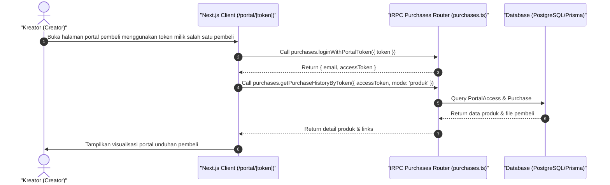

# Sequence Diagram - Akses Produk Lewat Portal (Kreator)

Diagram ini menjelaskan alur kasus penggunaan (use case) ke-41: **Akses Produk Lewat Portal (Kreator)** pada platform CuanIN.

### Detail Langkah / Deskripsi Alur:
Kreator meninjau halaman portal akses pembeli untuk memastikan format tautan unduhan pembeli.
