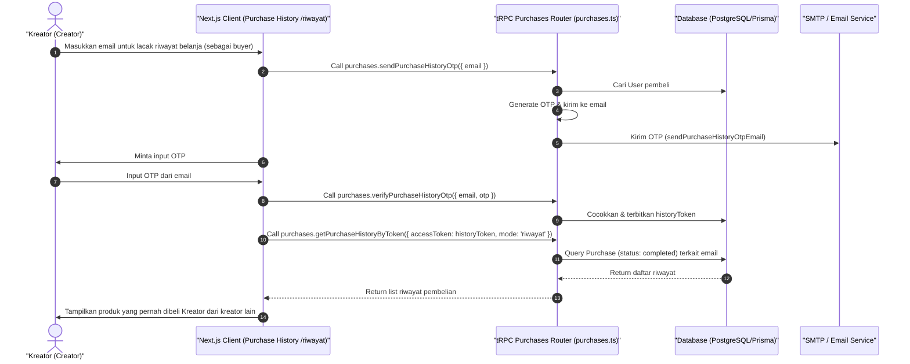

# Sequence Diagram - Lihat Riwayat Pembelian (Kreator)

Diagram ini menjelaskan alur kasus penggunaan (use case) ke-42: **Lihat Riwayat Pembelian (Kreator)** pada platform CuanIN.

### Detail Langkah / Deskripsi Alur:
Kreator melacak riwayat transaksi pembelanjaan pribadinya dari kreator lain di platform CuanIN.
