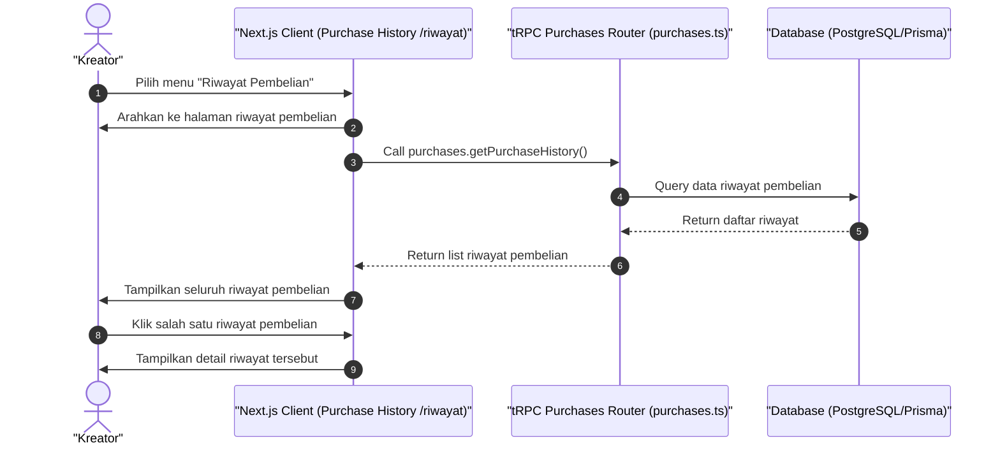

# Sequence Diagram - Lihat Riwayat Pembelian (Kreator)

Diagram ini menjelaskan alur kasus penggunaan (use case) ke-42: **Lihat Riwayat Pembelian (Kreator)** pada platform CuanIN.

### Detail Langkah / Deskripsi Alur:

**Kreator Lihat Riwayat Pembelian**
- **Aktor:** Kreator
- **Kondisi Awal:**
  1. Kreator sudah melakukan pembelian.
  2. Kreator sudah berada di halaman portal pelanggan.
- **Kondisi Akhir:** Kreator berhasil melihat riwayat pembelian.

**Skenario Utama:**
1. Kreator memilih "riwayat pembelian" pada menu.
2. Sistem mengarahkan Kreator ke halaman riwayat pembelian.
3. Kreator dapat melihat seluruh riwayat pembelian dan dapat melihat detailnya.
