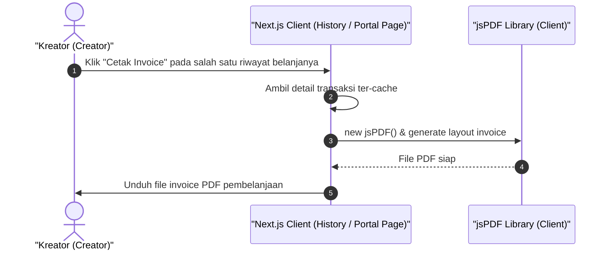

# Sequence Diagram - Cetak Invoice (Kreator)

Diagram ini menjelaskan alur kasus penggunaan (use case) ke-43: **Cetak Invoice (Kreator)** pada platform CuanIN.

### Detail Langkah / Deskripsi Alur:
Kreator mengunduh dokumen invoice digital berformat PDF atas transaksi pembelanjaan pribadinya.
