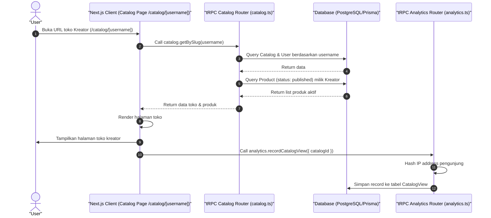

# Sequence Diagram - Lihat Katalog (Pembeli)

Diagram ini menjelaskan alur kasus penggunaan (use case) ke-44: **Lihat Katalog (Pembeli)** pada platform CuanIN.

### Detail Langkah / Deskripsi Alur:
User mengunjungi halaman katalog toko kreator untuk menelusuri produk yang dijual.
