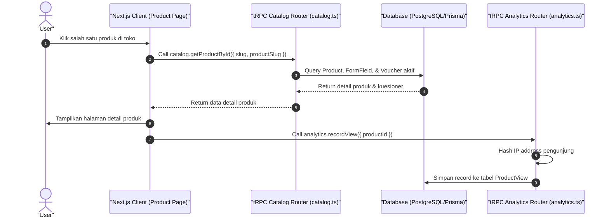

# Sequence Diagram - Lihat Detail Katalog (Pembeli)

Diagram ini menjelaskan alur kasus penggunaan (use case) ke-45: **Lihat Detail Katalog (Pembeli)** pada platform CuanIN.

### Detail Langkah / Deskripsi Alur:
User membuka halaman detail produk untuk melihat rincian informasi dan mengisi form pesanan.
